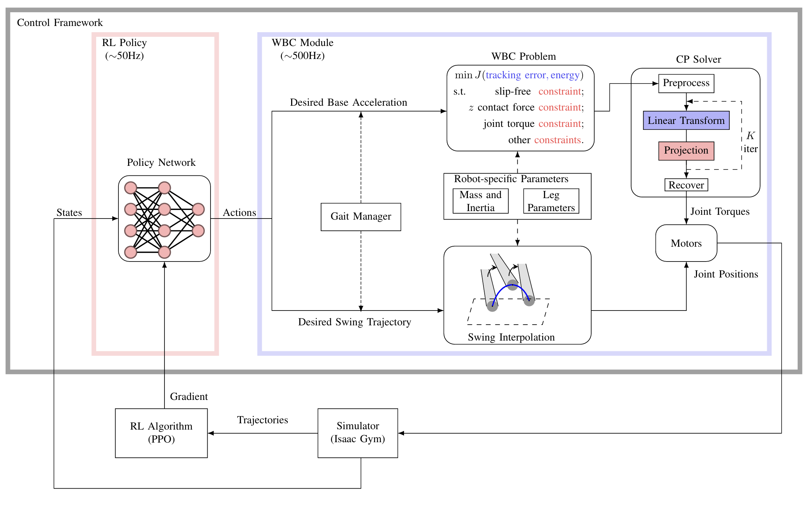

# RL_WBC Training Framework

This repository contains the code for the training framework of the RL_WBC project. The control framework consists of a high-level RL policy and a low-level Whole-Body Control (WBC) policy. 



Acknowledgement: The training framework is partially based on the [rsl_rl](https://github.com/leggedrobotics/rsl_rl) and [cajun](https://github.com/yxyang/cajun).

## Train

```bash
python train.py
```
Training arguments:
* `--num_envs=4096`: Number of parallel environments.
* `--show_gui=False`: Show the GUI of the simulation.
* `--max_iterations=600`: Maximum number of iterations.
* `--friction_type=[pyramid,cone]`: Friction type of the WBC formulation.
* `--solver_type=[pdhg, qpth]`: QP solver type.
* `--env_dt=0.02`: RL policy time step.


## Eval

```bash
python eval.py
```
Evaluation arguments:
* `--num_envs=4096`: Number of parallel environments.
* `--use_gpu=True`: Use GPU for evaluation.
* `--show_gui=False`: Show the GUI of the simulation.
* `--use_real_robot=[0,1,2]`: 0 for isaac gym, 1 for mujoco and 2 for real robot.
* `--name=[go1,go2,a1,mini_cheetah]`: Robot name.

## Basic PD+WBC Controller

```bash
python wbc_example.py
```